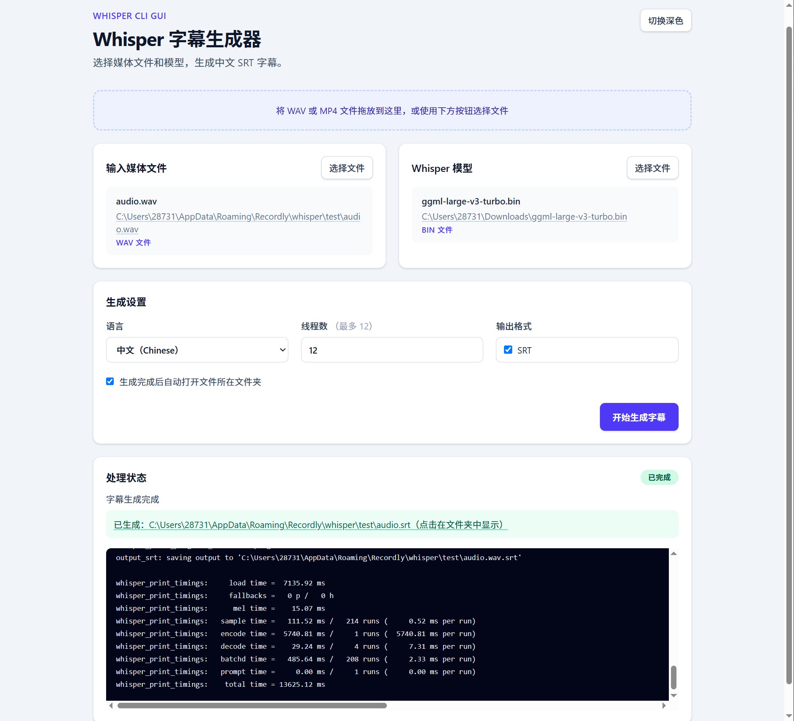

# Whisper 字幕生成器（Tauri 2）

Windows 桌面 GUI：通过已安装的 `whisper-cli` 将 WAV 或 MP4 文件转换为 SRT 字幕。桌面壳已从 Electron 迁移至 Tauri 2，使用系统 WebView2，以减少安装包体积并改善冷启动速度。

## 页面展示


## 前置条件

- Windows 10 或更高版本
- 已安装 `whisper-cli`，并可在命令提示符或 PowerShell 中直接运行
- 已下载 Whisper 模型文件，例如 `ggml-large-v3-turbo.bin`
- 若处理 MP4：已安装 `ffmpeg`，并可执行 `ffmpeg -version`

本工具不会捆绑模型或 Whisper CLI；请在界面中选择模型文件。

## 开发

还需要安装 [Rust stable](https://www.rust-lang.org/tools/install)（Tauri 2 后端使用 Rust）。

```bash
npm install
npm run dev
```

## 使用

1. 选择或拖放 WAV / MP4 文件。
2. 选择 `.bin` Whisper 模型。
3. 选择中文或英文，设置线程数（默认 8）。
4. 点击「开始生成字幕」。

WAV 会直接送入 Whisper。MP4 会先由 FFmpeg 转换为 16 kHz 单声道 PCM WAV，默认在完成或失败后自动删除；可在界面中选择保留为媒体文件同目录下的 `.whisper.wav` 文件。

程序会执行等价命令：

```text
whisper-cli -m "<模型路径>" -f "<媒体路径>" -l zh --output-srt -t 8
```

SRT 文件将由 `whisper-cli` 输出到输入媒体文件所在目录，通常与媒体文件同名且扩展名为 `.srt`。

## 构建

```bash
npm run package
```

Windows 安装程序会生成在 `src-tauri/target/release/bundle/nsis/`。Tauri 不会打包 Chromium、Whisper 模型或 CLI；Windows 10/11 上会使用系统提供的 WebView2。

## 发布 Windows 安装包

推送 `v*` 标签（例如 `v1.0.0`）会触发 GitHub Actions，在 Windows 上生成 NSIS 安装程序并自动附加到对应的 GitHub Release。

```bash
git tag v1.0.0
git push origin v1.0.0
```

也可以从 GitHub Actions 手动运行 **Build Windows release**，下载构建产物进行测试。
